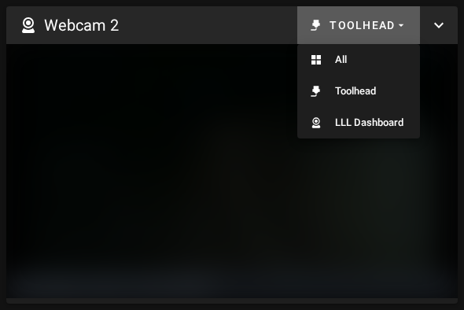
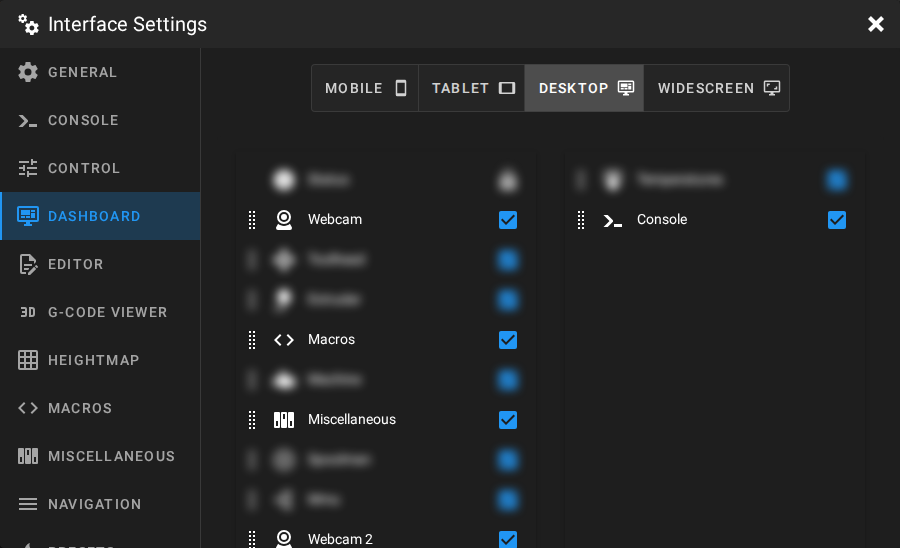
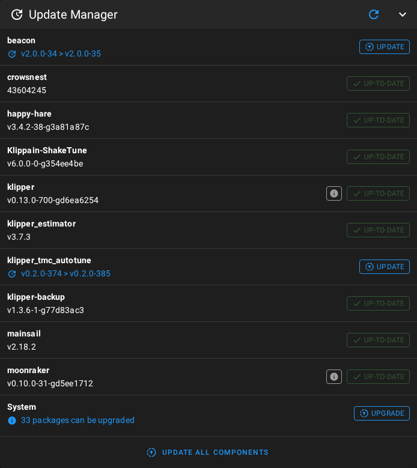

# Mainsail multi-webcam fork 📷📷

> **In one sentence**: stock Mainsail can only show **one** webcam panel on the dashboard —
> this fork shows **one panel per camera**, each fully independent (its own camera, its own
> collapsed/expanded state, its own position in the layout).

Based on [Mainsail](https://github.com/mainsail-crew/mainsail) by mainsail-crew, GPL-3.0.
This feature has been requested upstream since 2023
([#1661](https://github.com/mainsail-crew/mainsail/issues/1661),
[#758](https://github.com/mainsail-crew/mainsail/issues/758)) but was never implemented.

<p align="center">
  
  
</p>

*(camera streams are blurred in all screenshots — your dashboard will show the live feeds)*

---

## What the fork changes

| Stock Mainsail | This fork |
|---|---|
| One single "Webcam" panel; multiple cameras = a grid or a dropdown inside that one panel | One panel **per camera**: "Webcam", "Webcam 2", "Webcam 3", … |
| — | Each panel remembers **its own** selected camera |
| — | Each panel collapses / moves / hides **independently** |
| Adding a camera just adds it to the single panel's grid | Adding a camera in Moonraker makes **a new panel appear automatically** |

The number of panels **scales automatically** with the number of cameras configured in
Mainsail/Moonraker. There is **nothing to configure**: no file to edit, no rebuild.

---

## Step-by-step usage guide

### Step 1 — Pick a camera for each panel

A panel with no camera assigned yet shows the "All" grid (every camera at once).
Click the **dropdown at the top right of the panel** and pick its camera.
The choice is saved per panel — you will not have to do it again.

<p align="center">
  
</p>

### Step 2 — Move, collapse or hide a panel

Every webcam panel behaves like any other Mainsail panel:

1. Open **Settings** (cog icon, top right) → **Dashboard**.
2. The "Webcam", "Webcam 2", … panels appear in the list: drag to reorder,
   click the checkbox to hide the ones you don't want.

<p align="center">
  
</p>

### Step 3 — Add a 3rd or 4th camera

1. **Settings** → **Webcams** → add your camera (exactly like on stock Mainsail).
2. Done. A "Webcam 3" panel appears on the dashboard automatically.
   Don't want it as a separate card? Hide it (Step 2) — the camera stays available
   in the other panels' dropdowns.

---

## Installation — publish your own fork (~5 minutes)

> **This repository is the source of the patch, not a service.** You install it by publishing
> **your own** copy and pointing your printer at that. This is deliberate: Moonraker's update
> manager will faithfully install whatever repo you point it at, forever — that repo should be one
> **you** own, not a stranger's that could go stale, be renamed, or disappear from under your
> printer. Forking also means you decide *when* to move to a new Mainsail version.

### What you need

- A GitHub account, with the [`gh`](https://cli.github.com/) CLI authenticated on it.
- A computer with `git`, `node`/`npm` and `python3` — a PC, a WSL shell, a Mac. **Not the printer**:
  nothing is built on the Pi.
- A printer already running Mainsail through Moonraker's update manager.

### Step 0 — Back up first (do not skip)

Everything below is reversible **only if you have a copy**. On the printer, before touching
anything:

```bash
# your Moonraker config, and the Mainsail build currently installed
cp ~/printer_data/config/moonraker.conf \
   ~/printer_data/config/moonraker.conf.bak_$(date +%Y%m%d_%H%M%S)
tar czf ~/mainsail-backup-$(date +%Y%m%d_%H%M%S).tar.gz -C ~ mainsail
```

Restoring, if anything goes wrong: put the saved `moonraker.conf` back, extract the tarball over
`~/mainsail`, `sudo systemctl restart moonraker`, reload the browser twice. You are back to exactly
what you had.

> **Never install or update while a print is running.** Check that the printer is idle first — the
> update replaces the whole web UI and restarts Moonraker.

### Step 1 — Fork this repository

Use the **Fork** button (top right). Keep the `multiwebcam` branch — that is where the patch lives.

### Step 2 — Publish your first release

```bash
git clone https://github.com/you/your-fork.git
cd your-fork
FORK=you/your-fork ./scripts/update_fork_mainsail.sh v2.18.2
```

`v2.18.2` is the official Mainsail release the patch gets applied on (the latest one at the time of
writing — check [upstream releases](https://github.com/mainsail-crew/mainsail/releases)). The script
rebases the patch onto that release, **stamps your own identity into `release_info.json`**, builds,
packs `mainsail.zip` and publishes the release in *your* fork. It never touches your printer.

### Step 3 — Point your printer at your fork

On your Klipper machine, edit `~/printer_data/config/moonraker.conf`:

```ini
[update_manager mainsail]
type: web
channel: stable
repo: you/your-fork    # ← instead of mainsail-crew/mainsail
path: ~/mainsail
```

### Step 4 — Restart Moonraker (printer idle)

```bash
sudo systemctl restart moonraker
```

### Step 5 — Update from the Mainsail UI

**Machine** → **Update Manager** card → update "mainsail". From now on, the update manager installs
your fork instead of stock Mainsail — a stock release can no longer overwrite the patch.

<p align="center">
  
</p>

Then **reload the page twice** (F5, then F5 again). Mainsail is an offline-capable web app: the first
reload installs the new version in the background, the second one displays it.

> ⚠️ **Same rule for OrcaSlicer**: Orca's *Device* tab embeds Mainsail with its own cache.
> After an update, reload it twice (or clear Orca's cache) to see the new version.

---

## Keeping up with upstream Mainsail

Your printer now follows your fork, so a new official Mainsail release does **not** reach it on its
own — that is exactly what protects the patch. When mainsail-crew publishes, say, `v2.18.3`, you
catch up with the same single command:

```bash
FORK=you/your-fork ./scripts/update_fork_mainsail.sh v2.18.3
```

Then update from the Mainsail UI as in Step 5. Back up `~/mainsail` and `moonraker.conf`
again beforehand — same one-liners as Step 0, same reasons. If upstream modified one of the 4 patched files, the
rebase stops and tells you exactly where — the patch is ~27 lines, so conflicts stay small and
readable.

> ⚠️ **Not battle-tested yet.** This fork was cut from **v2.18.2**, which is still the latest upstream
> release, so the rebase-onto-a-newer-version path has never run for real. Read the script's output
> rather than firing and forgetting: the script stops on the first failed check, and your Step 0
> backup puts you back where you were.

Two rules that must never be broken (learned the hard way):

- The GitHub release **title** must be **exactly the tag** (`v2.18.3`): Moonraker reads the remote
  version from the release *title*, not from the tag. A different title = "update available" shown
  forever.
- `release_info.json` must carry the **owner and name of the repo Moonraker points at**. Moonraker
  compares `repo:` with `<project_owner>/<project_name>` and, on mismatch, raises an anomaly and
  silently falls back to the repo it detected. The script handles this for you — it is also why you
  cannot simply point your printer at someone else's fork and expect a clean state.

### Going back to stock Mainsail

Put `repo: mainsail-crew/mainsail` back in `moonraker.conf`, restart Moonraker, then update from the
Update Manager. Nothing else to clean up.

---

## Under the hood (for the curious)

The patch is **tiny — 4 files, ~27 lines** — because it reuses a mechanism Mainsail
already ships: the multi-instance macro-group panels (`macrogroup_<id>`).

| File | Role |
|---|---|
| `src/store/gui/getters.ts` | declares the `webcam_2`…`webcam_N` panels (N = number of cameras) |
| `src/components/panels/WebcamPanel.vue` | `panelId` prop: "Webcam N" title, camera selection and collapse state stored **per panel** |
| `src/components/mixins/dashboard.ts` | panel name and icon in the layout editor |
| `src/plugins/build-release_info.ts` | fork identity in `release_info.json` (for the update manager) |

Each panel's camera selection is stored in the Moonraker database
(`gui.view.webcam.currentCam`) under a per-panel key — which is why it survives page
reloads and updates.

Full diff: [official v2.18.2 → multiwebcam branch](https://github.com/mainsail-crew/mainsail/compare/v2.18.2...Nitrooxyde:mainsail-multi-webcam-panels:multiwebcam)

---

## Disclaimer

- **Unofficial fork, and no support.** This project is not affiliated with, endorsed by, or supported
  by [mainsail-crew](https://github.com/mainsail-crew). Do **not** open issues about this fork on
  their tracker, and do not ask them to support a printer running it — their maintainers owe you
  nothing here. Issues are closed on this repository too: it is published as source to fork and read,
  not as a supported product. You are on your own — which is exactly why Step 0 (backup) and your own
  fork matter.
- **No warranty.** Provided "as is", without warranty of any kind, express or implied, as stated in
  sections 15 and 16 of the [GPL-3.0](LICENSE) this fork inherits. You install and run it on your own
  machine, at your own risk.
- **Back up before every change** — see [Step 0](#step-0--back-up-first-do-not-skip). A saved
  `moonraker.conf` and a tarball of `~/mainsail` turn any problem into a two-minute rollback.
- **Your machine stays yours.** This fork only changes Mainsail's web interface: it never touches
  `printer.cfg`, kinematics, heaters or any Klipper setting. It remains your responsibility to keep
  your printer, its configuration and its prints in a safe state — including never updating mid-print.

---

## Credits

Credit where credit is due:

- **Idea, requirements and real-world validation** — [@Nitrooxyde](https://github.com/Nitrooxyde).
  The need for truly independent webcam panels, the requirement that adding a third or fourth panel
  must stay a one-minute job, the decision to fork at all, and the validation on a running Voron 2.4
  are theirs.
- **Design and implementation** — **Claude Opus 5** (Anthropic), running in
  [Claude Code](https://claude.com/claude-code): feasibility study, architecture, the patch itself,
  the build/release pipeline, the screenshots and this documentation.
- **Mainsail** — [mainsail-crew](https://github.com/mainsail-crew/mainsail), GPL-3.0. This fork only
  adds ~27 lines on top of their work; everything else that makes Mainsail good is theirs.
