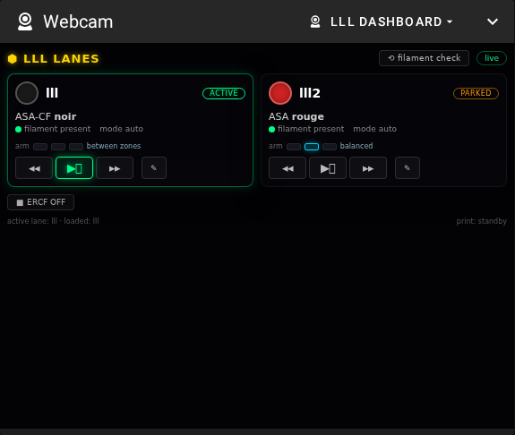
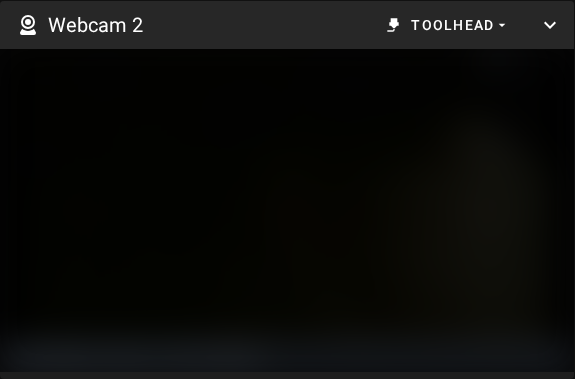

<h1 align="center">Mainsail Multi-Webcam Panels</h1>

  <b>A <a href="https://github.com/mainsail-crew/mainsail">Mainsail</a> fork for Klipper / Moonraker
  that gives every webcam its own dashboard panel.</b>

  "Webcam", "Webcam 2", "Webcam 3"… — one independent panel per camera, each with its own
  camera selection, its own collapsed state and its own position in the layout. Panels appear
  automatically as you add cameras in Moonraker: no dropdown, no split view, no configuration.

  
  

📖 **[FORK_MULTIWEBCAM.md](FORK_MULTIWEBCAM.md) — screenshots, what exactly changes, and the 2-minute install.**

- **Why** — stock Mainsail shows a single webcam panel; several cameras have to share it through a
  dropdown or a split grid. Requested upstream since 2022
  ([#1661](https://github.com/mainsail-crew/mainsail/issues/1661),
  [#758](https://github.com/mainsail-crew/mainsail/issues/758)), never implemented.
- **What it changes** — 4 files, 27 insertions on top of official Mainsail **v2.18.2**. Nothing else
  is touched; every other Mainsail feature behaves exactly as upstream.
- **Install** — the patch is public; the update channel is **yours and private**: build once with
  one script, push to your own private repo, point `[update_manager mainsail]` at it with a
  read-only deploy key. ~15 minutes, fully walked through in the
  [guide](FORK_MULTIWEBCAM.md#installation--your-own-private-update-channel-15-minutes). Updates can
  then never erase the panels — your printer only installs what you pushed.
- **Before anything** — back up `moonraker.conf` and `~/mainsail` on the printer
  ([Step 0](FORK_MULTIWEBCAM.md#step-0--back-up-first-do-not-skip)). Never update mid-print.
- **Keeping up with official Mainsail** — when mainsail-crew releases, one command rebases the patch
  onto the official tag and refreshes your channel; you update from the Mainsail UI as usual. The
  channel mechanism is exercised for real; the rebase onto a *newer* release is not yet (v2.18.2 is
  still the latest).

---

> ⚠️ **No releases, no binaries, no channel here.** This repository is source + documentation. Your
> printer updates only from **your own private channel repo** (see the guide) — never from this one.
>
> ⚠️ **Unofficial fork, no warranty, no support.** Not affiliated with or supported by mainsail-crew —
> please don't take issues about this fork to their tracker; issues are closed here as well. Published
> as source to fork and read. Provided "as is" under [GPL-3.0](LICENSE) (see sections 15–16); you run
> it on your own printer, at your own risk, and you back up before changing anything. Full terms:
> [Disclaimer](FORK_MULTIWEBCAM.md#disclaimer).

---

## Credits

Credit where credit is due:

- **Idea, requirements and real-world validation** — [@Nitrooxyde](https://github.com/Nitrooxyde).
  The need for truly independent webcam panels, the requirement that adding a third or fourth panel
  must stay a one-minute job, the decision to fork at all, and the validation on a running Voron 2.4
  are theirs.
- **Design and implementation** — **Claude Opus 5** (Anthropic), running in
  [Claude Code](https://claude.com/claude-code): feasibility study, architecture, the patch itself,
  the build/release pipeline, the screenshots and this documentation.
- **Mainsail** — [mainsail-crew](https://github.com/mainsail-crew/mainsail), GPL-3.0. This fork only
  adds ~27 lines on top of their work; everything else that makes Mainsail good is theirs.

---

Everything below is the original Mainsail README, from the upstream project by mainsail-crew.

  <a>
    
    <h2 align="center">Mainsail</h2>
  </a>

  Makes Klipper more accessible by adding a lightweight, responsive web user interface, centred around an intuitive and consistent design philosophy.

  
  
  
  
  
  
   
  
  
  

## Getting Started

Visit [docs.mainsail.xyz/setup](https://docs.mainsail.xyz/setup) to get started with Mainsail.

Mainsail is also available in remote mode on [http://my.mainsail.xyz](http://my.mainsail.xyz). Find
out [more](https://docs.mainsail.xyz/setup#mymainsailxyz).

## Documentation

Visit [docs.mainsail.xyz](https://docs.mainsail.xyz) to view the full documentation.  
You can find the latest release notes [here](https://github.com/mainsail-crew/mainsail/releases).

## Screenshots

## Features

- **Responsive Web Interface:** _Optimized for desktops, tablets and mobile devices_
- **Printer Farm:** _Supports multiple 3D printers_
- **[Localization](https://docs.mainsail.xyz/features/localization):** _Choose between 12 different languages_
- **File Manager:** _Delete, rename and upload your G-Code and config files_
- **File Editor:** _Edit G-Code and config files with syntax highlighting in your browser_
- **[Print History](https://docs.mainsail.xyz/features/history):** _See your previous prints and their status_
- **[Statistics](https://docs.mainsail.xyz/features/history):** _View how much time your printer has been in use and the number of jobs that have succeeded or failed_
- **Job Queue:** _Queue multiple jobs and add them directly from your slicer_
- **[Temperature Presets](https://docs.mainsail.xyz/features/presets):** _Manage different temperature presets for easy preheating_
- **[Bed Mesh Visualisation](https://docs.mainsail.xyz/features/bedmesh):** _View your bed using a 3D mesh graph_
- **G-Code Viewer:** _View a 3D render of your print and follow the progress_
- **Multi-Webcam Support:** _View your print from different angles with multiple webcams_
- **Timelapse Integration:** _Automatically record a timelapse of your print using [moonraker-timelapse](https://github.com/mainsail-crew/moonraker-timelapse)_
- **Power Control:** _Control power devices such as relays, TP-Link and Tasmota devices, and more_
- **Powerful Macro-Management:** _Manage your macros on a micro level_
- **[Configurable Dashboard](https://docs.mainsail.xyz/features/dashboard-organisation):** _Create your own personal dashboard_
- **[Theming Support](https://docs.mainsail.xyz/features/theming):** _Customizable user interface including logos, backgrounds, and custom CSS_
- **[Additional Sensors](https://docs.mainsail.xyz/quicktips/additional-sensors):** _Add extra sensors to the temperature graph_
- **Exclude Objects:** _Exclude parts of your print (not officially supported by Klipper yet)_

## Help and Support

Do you need help or just want to talk? Join our active community on [Discord](https://discord.gg/skWTwTD)!

Did you find a bug or did you thought of a feature?
Please create an [Issue](https://github.com/mainsail-crew/mainsail/issues) in GitHub and let us know.

## Official Sponsors

    

**BIGTREETECH** is the official mainboard partner of Mainsail. BIGTREETECH is committed to developing innovative and competitive products to better serve the 3D printing community.

## Support Mainsail

Mainsail is primarily developed and maintained by meteyou. To keep the project going he invests his free time, almost
every day. To motivate him (☕🍺😜) there are several ways to support him:

## Contributing

Contributions to Mainsail are always welcome!

- 📥 Pull requests and 🌟 Stars are always welcome.
- Read our [contributing guidelines](CONTRIBUTING.md) to get started,
  or find us on [Discord](https://discord.gg/mainsail), we will take the time to guide you.

Looking for a first issue to tackle?

- We tag issues with  when we think they are well suited for people who are new to the codebase or OSS in general.
- [Talk to us](https://discord.gg/mainsail), we'll find something that suits your skills and learning interest.

## Credit, sources and inspiration

- [Kevin O'Connor](https://github.com/KevinOConnor) for the awesome 3D printer firmware [Klipper](https://github.com/KevinOConnor/klipper)
- [Eric Callahan (arksine)](https://github.com/Arksine) for [Moonraker (Klipper API)](https://github.com/Arksine/moonraker). Without Moonraker, Mainsail would not be possible.
- [lixxbox](https://github.com/lixxbox) for the Mainsail logo & Docs
- [Vue.js](https://vuejs.org/): The Progressive JavaScript Framework
- [Vuetify](https://vuetifyjs.com/): Material Design Component Framework for Vue.js

Massive thanks to the whole [Voron Design](http://vorondesign.com/) community. Without them such a project would not be
possible.

[Full Credits & License information](https://docs.mainsail.xyz/credits)
